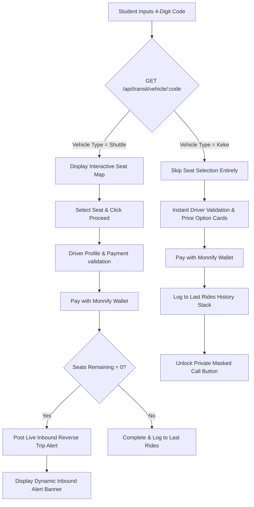

# Unified Campus Transit Search: Implementation Walkthrough

We have successfully integrated the **Unified Transit Search (Shuttle vs. Keke)** system directly into your Monnify Wallet application! The architecture simulates a high-performance **Supabase** backend query, routes students down highly customized vehicle paths, confirms payments via the Monnify digital wallet, posts inbound alerts dynamically, and unlocks secure proxy-masked calling.

---

## 🚍 System Architecture Overview



### 🔐 Supabase Query Mapping (How to Transition from Mock to Live)
In `index.js`, we have structured a simulated Supabase vehicle database. To hook it up to your live Supabase client, simply swap the lookup block:

**Current Mock Lookup (in `index.js`):**
```javascript
app.get('/api/transit/vehicle/:code', (req, res) => {
    const code = req.params.code.trim();
    const vehicle = vehicles[code]; // Local memory database
    if (!vehicle) return res.status(404).json({ error: 'Code not found' });
    res.json(vehicle);
});
```

**Live Supabase Replacement:**
```javascript
app.get('/api/transit/vehicle/:code', async (req, res) => {
    const { code } = req.params;
    const { data: vehicle, error } = await supabase
        .from('vehicles')
        .select('*')
        .eq('code', code)
        .single();
        
    if (error || !vehicle) {
        return res.status(404).json({ error: 'Vehicle code not found.' });
    }
    res.json(vehicle);
});
```

---

## ✨ Features and UI Breakdown

### 1. Unified Search Glassmorphic Section
Added a card-based **Campus Transit** widget on the dashboard:
* A modern, glowing input field accepting unique 4-digit codes.
* Hover effects and rapid-select links so you and Nabil can immediately test both flows (`1001` or `2002`).

### 2. Path A: Shuttle Booking Flow (`1001`)
* **Seat Map Grid**: Displays a high-fidelity visual grid matching a standard Toyota HiAce cabin layout (14 seats).
  * **Vacant Seats** feature a dark indigo glass outline.
  * **Taken Seats** display a dark crimson background with a locked padlock icon.
  * **Selected Seat** dynamically glows vibrant green with an active shadow.
* **Instant Profile Check**: Opens Mustapha Yusuf's driver card, vehicle plate details, virtual account information, and a ticket price of **₦500.00**.
* **Automated Reverse Trips**: If the final seat on the Shuttle is booked, the backend instantly posts a **"Reverse Trip" scheduled alert** for students waiting at the opposite camp site (e.g. *Annex Campus*) to let them know a vehicle is inbound.

### 3. Path B: Keke Flow (`2002`)
* **Skip Seats**: Bypasses the seat map entirely, routing the student instantly to Ibrahim Bello's validation profile.
* **Price Selector pills**: Allows the student to select from a choice of price options (**₦200**, **₦300**, or **₦500**) with smooth toggle transitions.
* **Direct Monnify Wallet Deduction**: Instant validation via the Wema Bank virtual account card and wallet pay verification.

### 4. Last Rides Stack & Masked Call Unlocked
* Payments instantly append the driver to the student's **"Last Rides"** list on the home dashboard.
* Clicking any ride card in the list displays a premium **Secure Masked Call overlay**:
  * An animated circular **dialing radar pulse ring** (`pulseRing` animation).
  * Shows proxy phone numbers (e.g. `+234 700 748 8853`) to preserve user privacy.
  * Dynamically changes status to **"Secure Routing Established"** after 3 seconds, keeping both phone numbers fully secure.

---

## 🧪 Testing Checklist (Step-by-Step for Nabil)

Use this quick guide to run Nabil through both flows in the dev environment:

1. **Launch App**: Open `http://localhost:3000` in the browser.
2. **Onboard**: Register a username (e.g., `nabil`) to initiate a virtual bank account.
3. **Simulate Deposit**: Click **Add Money**, enter `10000`, and click **Simulate Deposit** to credit the wallet.
4. **Test Flow A (Shuttle)**:
   * Enter `1001` in the search bar and click Search.
   * Confirm the seat map pops up. Choose an available seat and click **Confirm**.
   * Pay using the digital wallet. Confirm balance updates and seat booking logs to Recent Activity.
5. **Test Flow B (Keke)**:
   * Enter `2002` in the search bar and click Search.
   * Confirm it skips the seat map and opens Ibrahim Bello's card.
   * Pick `₦500` and pay.
6. **Verify Masked Call**:
   * Click Ibrahim's newly added card in the **Last Rides** section.
   * Witness the sleek dialed phone interface and secure proxy number simulation.
